# TDD/CI/CD Walkthrough Facilitator's Guide

This project supports part 1 of a 3-part demonstration/walkthrough/dojo exercise. By the end of the series, you'll have a reusable jar containing the "Hello, World!" functionality, a standalone Java app, a RESTful microservice, and a working CI/CD pipeline.

## 1. Purpose and overview

Walk through a simple development exercise that demonstrates several general good development practices. Key concepts that can be illustrated through this walkthrough:

* Using Maven for Java projects - _check_
* Separation of concerns - _check_ 
* Using a version control system - _check_
* Single branch strategy - _check_
* Setting up continuous integration - _check_
* Using an IDE
* Packaging a reusable jar to be uploaded to a repository
* Test-driving application code through microtests
* Benefits of frequent commits

Subsequent parts of the walkthrough:

* Using Spring Boot with Maven 
* Packaging applications for deployment
* Setting up continuous deployment
* Writing a standalone Java application suitable for cloud deployment
* Writing a RESTful microservice in Java suitable for cloud deployment
* Organizing an automated test suite

The facilitator is free to omit, add, and emphasize topics as appropriate for the audience, and to change the code, the sequence of presentation, or any other aspects of the walkthrough to suit his/her needs.

## 2. Resources

•	PowerPoint deck: tdd-ci-cd-walkthrough.pptx

## 3. Overview

A trivial "Hello, World!" application is the basis for the walkthrough. The point is not to produce the string, "Hello, World!", but rather to demonstrate how to set up a simple CI/CD pipeline and, while we're at it, how to apply a few generally-accepted good software design/development practices. The presentation aims at breadth rather than depth; it shows how to set up an end-to-end pipeline that works, but doesn't delve into any of the individual topics. 

## 4. Sequence

Start with the deck. The first few slides suggest a goal for the exercise. Take a look at the speaker notes and adjust them according to your own preferences as a guide/mentor.

After the slide that gives participants the URL to the tutorial, switch to this document and follow the sequence of actions below.

### 4.1. Necessary software

Participants will need the following software installed on their machines:

* Java JDK version 1.8
* Maven 3.3 or higher
* Git client
* A text editor (any)
* A Java-aware IDE (if desired)

If you're using a Randori or Mob format for the session, then you'll only need to configure the machines that will be used in the exercise.


### 4.2. Separation of concerns

The sample code presented in section 11.3 of the Spring Boot tutorial is designed to demonstrate basic Spring Boot usage in an easy-to-read format. For that reason, all the code is included in a single Java class. 

In real life, we wouldn't organize the code in that way. Unfortunately, people often take what they find in a tutorial and replicate it in their real projects. This time, we're going to break the code apart right from the beginning, and maintain separation of concerns. 

If we don't do that, then we run the risk of accumulating cruft in our code. We'll have to deal with the cruft sooner or later anyway, and it's easier to deal with it sooner than later.

Display the sample Java source code in the tutorial. It looks like this:

```java
import org.springframework.boot.*;
import org.springframework.boot.autoconfigure.*;
import org.springframework.stereotype.*;
import org.springframework.web.bind.annotation.*;

@RestController
@EnableAutoConfiguration
public class Example {

    @RequestMapping("/")
    String home() {
        return "Hello World!";
    }

    public static void main(String[] args) throws Exception {
        SpringApplication.run(Example.class, args);
    }
}
```

Lead a discussion with the group to see if they can identify any issues with this code. If they need a hint, mention _separation of concerns_.

Here's what we're looking for (according to this author, anyway):

The ```main``` method, the "Hello" functionality, and the RESTful service wrapper code are three different _concerns_. In a "real" application, we would not combine these concerns in the same class. For this exercise, we're going to separate these concerns right from the start.

Ask the group if they can see any other potential problems with the code. 

The second thing we're looking for (at least, according to this author) is the fact there are no unit tests; the code is not _test-driven_. There is no automated regression suite to help us refactor safely and add features without creating bugs that slip through to production. 

As conscientious developers, we would normally test-drive any new code. Therefore, we're going to do that for this exercise right from the start.

One final issue is that the sample code uses the _default package_. In a "real" application, all Java classes would belong to a package. We're going to start with the default package and refactor the first Java class into a proper package after we've migrated everything into an IDE. For the moment, don't worry about the package. Just mention that real production code isn't written that way. 


### 4.3. The POM for the library project

Consider section 11.1 of the tutorial. 

Explain what a POM is, if necessary. Don't spend too much time on it. If people aren't confident in their knowledge of Maven POMs, they can follow up later. Point them to appropriate online resources. 

We're using a published Spring Boot tutorial as the basis for the exercise, but for this particular project (to create a standard reusable jar) we're not going to use Spring Boot. We won't define the POM that is presented in the tutorial. Instead, we'll use a POM suitable for creating a basic Java jar - not an executable jar or a Spring Boot artifact. This jar will become a dependency for subsequent walkthroughs in the series.

The POMs for the follow-on projects for parts 2 and 3 of the walkthrough will be different, as they will include Spring Boot dependencies.

Explain the contents of the initial POM for this project. It is designed to conform with requirements for uploading a jar to Maven Central. Therefore, it contains more entries than the usual "minimal" POM that is presented in basic Maven tutorials. When we prepare a reusable jar in "real life," we need to follow these guidelines so that our work can be accepted in a repository. 

If you're using a private Nexus instance in your company, find out about the guidelines for submitting jars to that repository. They may differ from the standard guidelines for Maven Central.

```xml 
<project xmlns="http://maven.apache.org/POM/4.0.0" xmlns:xsi="http://www.w3.org/2001/XMLSchema-instance"
  xsi:schemaLocation="http://maven.apache.org/POM/4.0.0 http://maven.apache.org/maven-v4_0_0.xsd">
  <modelVersion>4.0.0</modelVersion>
  <groupId>com.neopragma</groupId>
  <artifactId>javahellolib</artifactId>
  <packaging>jar</packaging>
  <version>1.0.0-SNAPSHOT</version>
  <name>${project.groupId}:${project.artifactId}</name>
  <description>Create reusable jar containing general 'hello' functionality for Enterprise Greetings.</description>
  <url>http://github.com/neopragma/javahellolib</url>

  <licenses>
	<license>
	  <name>MIT License</name>
		<url>http://www.opensource.org/licenses/mit-license.php</url>
		<distribution>repo</distribution>
	</license>
  </licenses>

  <scm>
    <connection>scm:git:git://github.com/neopragma/javahellolib.git</connection>
    <developerConnection>scm:git:ssh://github.com:neopragma/javahellolib.git</developerConnection>
    <url>http://github.com/neopragma/javahellolib/tree/master</url>
  </scm>  

  <developers>
    <developer>
      <name>Dave Nicolette</name>
      <email>davenicolette@gmail.com</email>
      <organization>Neo Pragma</organization>
      <organizationUrl>http://neopragma.com</organizationUrl>
    </developer>
  </developers>

  <properties>
    <project.build.sourceEncoding>UTF-8</project.build.sourceEncoding>
    <java.version>1.8</java.version>
  </properties>

  <dependencies>
    <dependency>
      <groupId>junit</groupId>
      <artifactId>junit</artifactId>
      <version>4.12</version>
      <scope>test</scope>
    </dependency>
  </dependencies>

  <build>
    <plugins>
    
      <plugin>
        <groupId>org.apache.maven.plugins</groupId>
        <artifactId>maven-source-plugin</artifactId>
        <version>3.0.1</version>
        <executions>
          <execution>
            <id>attach-sources</id>
            <goals>
              <goal>jar</goal>
            </goals>
          </execution>
        </executions>
      </plugin>

      <plugin>
        <groupId>org.apache.maven.plugins</groupId>
        <artifactId>maven-javadoc-plugin</artifactId>
        <version>2.10.4</version>
        <executions>
          <execution>
            <id>attach-javadocs</id>
            <goals>
              <goal>jar</goal>
            </goals>
          </execution>
        </executions>
      </plugin>    
    
    </plugins>
  </build>  
</project>
```

### 4.4. Creating the Maven directory structure

We're still working on the command line, without using an IDE that "knows" how to create a Maven project automatically.

Create the usual Maven source directories:

```shell
mkdir -p src/main/java
mkdir -p src/test/java
```

Or on Microsoft Windows:

```shell
mkdir src\main\java
mkdir src\test\java
```

On Microsoft Windows only, if command extensions are not enabled on your system, you can write a short script to create directory trees, like this:

```shell
@echo off
setlocal enableextensions
md %1
endlocal
```

Maven is based on the concept of _convention over configuration_. If you place certain artifacts in certain locations and give them certain names, Maven will automatically process them appropriately. Otherwise, you'll have to override Maven's defaults through POM entries. 

The standard Maven directory layout is documented here: https://maven.apache.org/guides/introduction/introduction-to-the-standard-directory-layout.html


### 4.5. Setting up version control

The basis of good development practices such as test-driven development, continuous integration, and continuous deployment is _version control_. Guide participants in creating a git repo on ```github.com```. You can skip that and just show them your own repo, if that makes more sense in your situation.

Once that has been set up, open a command line window and navigate to the project root directory. Set up a local git repo for the project:

```shell
git init
git config --global user.name "Your Name"
git config --global user.email "youremail@wherever.com"
git remote add origin master [url]
git add .
git commit -m "Initial commit"
```

If necessary, briefly explain the difference between committing to the local repo and pushing changes to Github. Mention that their company may have its own private Github instance. If so, then that is where they would set up any new projects for their company.

There are always some files that are local to your development environment and should not be managed in the version control system. Version control systems have a mechanism to identify such files. When using Git, you can include a file named ```.gitignore``` in the project root directory. This is a plain text file listing filename patterns to ignore, one entry per line. Here's an example:

```shell  
/target/
*~
.DS_Store
```

The sample ```.gitignore``` entries tell git not to include the following files in commits:

* The ```target``` directory and everything in it
* Files whose names end with a tilde ("~") - relevant to Linux
* Files named .DS_Store - relevant to OSX


### 5. Starting development

Now we're set up sufficiently to begin writing some code.

### 5.1. A little up-front planning

Guide the group through the process of deciding _how_ to separate the concerns in this application:

* Core "business" functionality (in this case, saying "Hello")
* RESTful service wrapper code  
* ```main``` method to run the application as a Java application

Granted, the three pieces will be very small, and this might appear to be a bit pointless to some of the participants. The key idea is that if we _start_ by doing things right, we'll avoid headaches later.

This particular project is only concerned with the first of those three concerns - the core business functionality, which will be packaged as a reusable jar.


### 5.2. Test-driving the core functionality

Let's begin with the core "business" functionality. The all-important ability to say "Hello" represents a significant competitive advantage for our company. We must be sure to build it well, or our company will soon be saying "Goodbye."

The next aspect of sound software development methods we will include in the exercise is _test-driven development_. Here's how that practice is depicted on the C2 wiki:

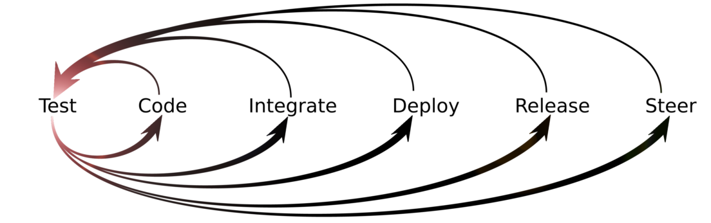

As the diagram implies, we'll start by writing a test. It's a very small test case that expresses a bit of the expected behavior of the application we're building. Some people call these tests _unit tests_, but that term is overloaded and means different things to different people. We call it a _microtest_, to be sure it's clearly defined.

A microtest exercises the smallest unit of code that can produce any observable result. In the case of Java, that means a _single path through a single method_. 

We're going to use ```JUnit``` as the automated testing framework for this exercise. The starter POM described above already contains a declaration of this dependency: 

```xml
<dependency>
    <groupId>junit</groupId>
    <artifactId>junit</artifactId>
    <version>4.12</version>
</dependency>
```

Now create a Java class file, ```HelloTest.java```, in the ```src/test/java``` directory. (We're still working with a simple text editor.) Make it something like this:

```java
import org.junit.Test;
import static org.junit.Assert.assertEquals;

public class HelloTest {    
    @Test
    public void itSaysHello() {
        Hello hello = new Hello();
        assertEquals("Hello, World!", hello.greet());
    }
}
```

Walk participants through the test class and explain it. The method ```itSaysHello``` expresses one discrete bit of application behavior. We assume there will be an object of type ```Hello``` that will contain a method named ```greet``` which is expected to return the string, "Hello, World!" when called.

Now run:

```shell
mvn test
```

You'll see errors indicating the symbol ```Hello``` could not be found, like this:

```shell
[ERROR] Failed to execute goal org.apache.maven.plugins:maven-compiler-plugin:3.1:testCompile (default-testCompile) on project myproject: Compilation failure: Compilation failure:
[ERROR] /Users/dave/Documents/Projects/springboot-tutorial/src/test/java/HelloTest.java:[7,9] cannot find symbol
[ERROR] symbol:   class Hello
[ERROR] location: class HelloTest
```

We're now experiencing test-driven development. The _feedback_ from our microtest is telling us to create a Java class named ```Hello```. Who are we to argue?

Create a file named ```Hello.java``` in directory ```src/main/java``` with the following contents:

```java   
public class Hello {
    public String greet() {
        return "Hello, World!";
    }
}
```

Now let's try running the tests again:

```shell  
mvn tests
```

This time we see output like this:

```shell  
Results :
Tests run: 1, Failures: 0, Errors: 0, Skipped: 0
[INFO] ------------------------------
[INFO] BUILD SUCCESS
[INFO] ------------------------------
[INFO] Total time: 2.722 s
[INFO] Finished at: 2016-11-15T16:26:38-06:00
[INFO] Final Memory: 24M/217M
```

People often speak of the _red-green-refactor_ cycle of TDD. Our failing microtest was the _red_ step. Now we've made that microtest pass. That's the _green_ step. 

The third step involves examining the code we've just written to see if it could be simplified. At the moment, there's nothing to refactor, as we haven't build up any _cruft_ in the code. 

We want to establish the habit of examining our code every time we reach _green_ so we can keep the design clean at all times. For now, we'll agree as a team, explicitly, that there's no refactoring to be done at this time. 

It is important to cultivate the habit of _explicitly deciding_ there is no refactoring to do, rather than _assuming_ there's no need for it just because we haven't yet built up much of a code base.

### 5.3. Committing to version control

Continuous integration (CI) means pushing small changes frequently and checking for integration problems. 

To keep things simple, it's a generally-accepted good practice for all team members to work on a single branch of the source code. With Git, this branch is called _master_. With Subversion, it's called _trunk_. Other version control systems may have different terminology, but the concept is the same. 

The general procedure for committing code with a single branch strategy is:

1. Run all tests locally
1. Update local from head
1. Run all tests locally 
1. Push to origin (master branch)
1. Check feedback from the CI build and fix if broken

In larger organizations, there's a common _management dysfunction_ whereby only selected individuals or a designated "integration team" have access rights to commit to master or trunk. The fear is that someone will make a mistake. Here are the proper protections against the possibility of a mistake:

1. Educate the staff.
1. Work as a team to cross-check each other.
1. You can always revert to a known good version. After all, it's a _version control_ system.
 
We just ran all tests locally. Let's see if we need to pull any changes from origin. "Hello, World!" is a big project, and there could be many people all around the world contributing to it at the same time. Better safe than sorry. 

```shell  
git status
```

You'll see output like this:

```shell  
Daves-MacBook-Pro:springboot-tutorial dave$ git status
On branch master
Your branch is up-to-date with 'origin/master'.
nothing to commit, working directory clean
```

This means we don't have to merge any changes from origin that someone else might have pushed while we were working. We're good to go.

Let's push our changes.

```shell  
git push -u origin master
```

Okay. Now all we have to do is wait for the CI server to run the build. It should start automatically when it detects something was pushed to the version control system.

Tick, tock, tick, tock. Hmm. Nothing is happening.

Oh, wait a second. We haven't set up continuous integration. 

But isn't that someone else's job? Some sort of infrastructure team, or something?

Actually, it isn't someone else's job. If we're the development team, then all aspects of development are part of our job. If all you do is sling code, are you really a _developer_, or just a _coder_? So, let's get busy!

## 6. Setting up continuous integration

The next loop in the TDD diagram after _test_ and _code_ is _integrate_. Let's set up our project for continuous integration using Travis CI, an online service.

Show participants how to sign up for Travis CI and connect their Github repository to it. Then show them how to add a ```.travis.yml``` file to the project, in the project root directory. Here's the minimum ```.travis.yml``` file for a Java 8 project:

```shell  
language: java
jdk:
  - oraclejdk8
```

Assuming you've set up the repository on Travis CI, when you push the ```.travis.yml``` file to the Github repo it will trigger a build on Travis.

```shell  
git add .travis.yml
git commit -m "Added travis.yml file"
git push -u origin master
```

Display the Travis site in a browser and let participants watch the progress of the build. It won't be as quick as a build on their own CI server, because Travis has to download all the dependencies. If they had their own instance of, say, Jenkins, then the dependencies would be cached in the local ```.m2/repository``` directory on the CI server. 

Ultimately, you'll see the same Maven output on Travis as you see on the local box for ```mvn test```:

```shell  
Running HelloTest
Tests run: 1, Failures: 0, Errors: 0, Skipped: 0, Time elapsed: 0.003 sec - in HelloTest
Results :
Tests run: 1, Failures: 0, Errors: 0, Skipped: 0
```

You might not want the CI build to run after every commit. For example, if you modified the project ```README.md``` file but made no changes to code or configuration files, there's nothing to be gained by rebuilding the app. To suppress Travis CI, include the string "[skip ci]" or "[ci skip]" somewhere in the commit message; for example:

```shell 
git commit -m "Updated README. [skip ci]"
```

## 7. Where do we stand?

We've looked at several good development practices so far:

* Using Maven for Java projects - _check_
* Separation of concerns - _check_ 
* Using a version control system - _check_
* Single branch strategy - _check_
* Setting up continuous integration - _check_
* Using an IDE
* Packaging a reusable jar to be uploaded to a repository
* Test-driving application code through microtests
* Benefits of frequent commits
* Organizing an automated test suite

## 8. Using an Integrated Development Environment

Before we build up any more code, let's move the project into an IDE. It's much more convenient to do serious Java development with an IDE than to use a bare-bones text editor and the command line. IDEs have useful features like code completion, refactoring, in-context javadoc display, boilerplate code generation, import management, stylistic suggestions, and color coding.

You are free to use any IDE you wish. These instructions assume Spring Tool Suite will be used, because it's all based on a Spring Boot tutorial. This is only for general consistency; Spring Tool Suite isn't an absolute necessity.

### 8.1. Import the project into Spring Tool Suite

To import the project into Spring Tool Suite, start the IDE and right-click in the Package Explorer pane. Choose Import... and then Maven -> Existing Maven projects. 

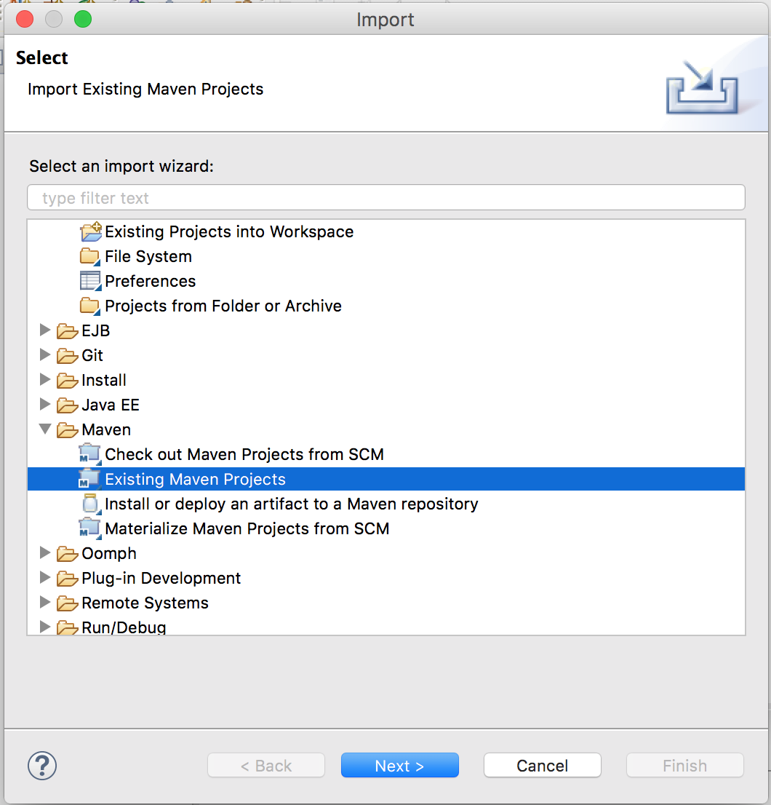

 Select the root directory of the tutorial project.
 
 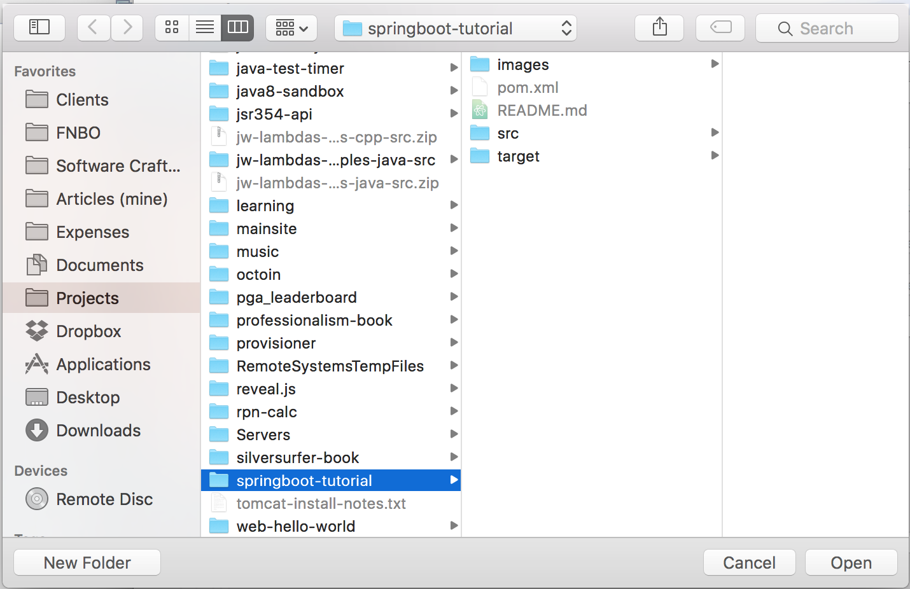
 
It should look something like this:

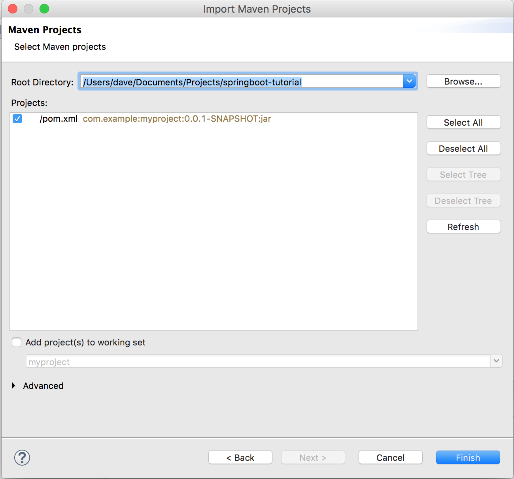

Now the tutorial project will show up in the Package Explorer pane. It will look something like this:

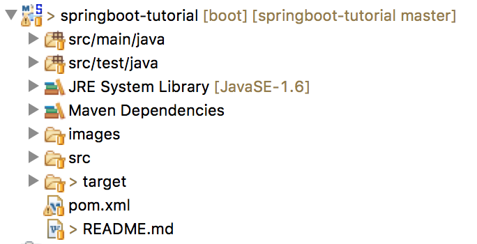

### 8.2. Running tests inside the IDE

Show participants how to run ```mvn test``` from inside the IDE by right-clicking on ```pom.xml``` and choosing Maven -> Run as -> Maven test. You may have to adjust project settings to get it to use the correct JDK and JRE version.

Show participants how to run JUnit tests by right-clicking on any test folder, class, or method and choosing Run as -> JUnit test. 

Discuss when to use each method to run tests. For instance, when you need to check just one or a few unit tests while in the midst of development, it's convenient to use Run as -> JUnit test. To be sure you are doing things as close to the way they will happen in the delivery pipeline, run the tests with Maven. That is how the CI server will run them. It's a good idea to be sure you aren't getting false positives. 

In fact, it's a good idea to run ```mvn test``` from a command line from time to time, to be sure the IDE's configuration isn't subtly different from the configuration in the POM. 

## 9. Creating Java packages

So far all our code lives in the _default package_. This isn't very realistic. Let's define a Java package. (It's a good excuse to demonstrate the _refactoring_ features of the IDE.)

You can use the keyboard shortcut for the platform you're using or the context menu in the Package Explorer pane in the IDE to choose Refactor -> Move for the file ```HelloTest.java```.

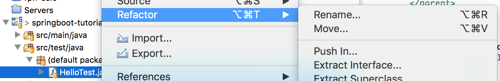

In the refactor dialog window, choose _Create Package_

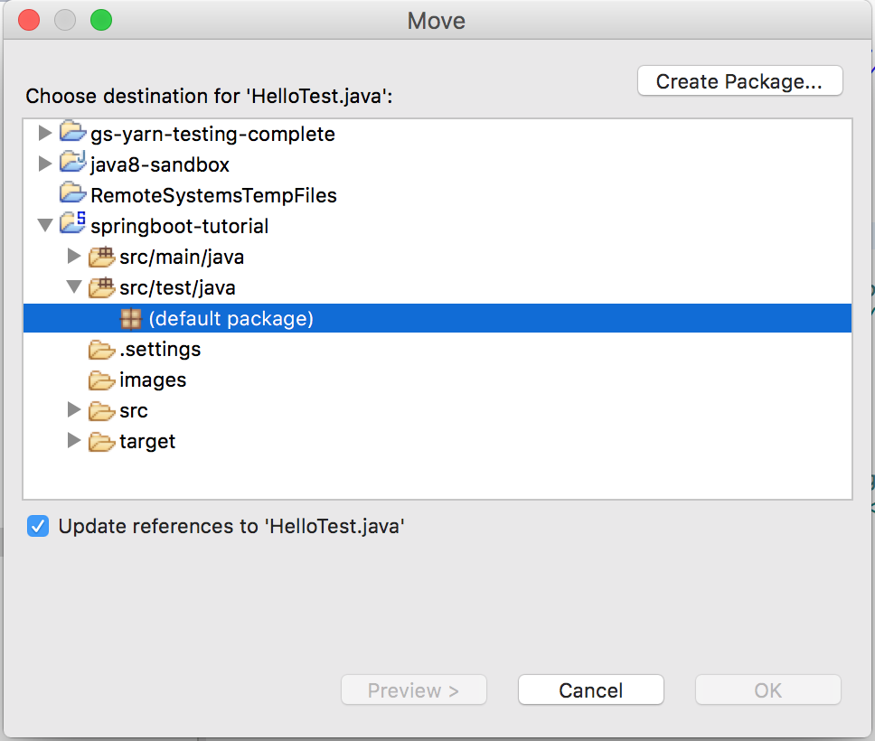

Give the package whatever name you want, or that your participants choose. 

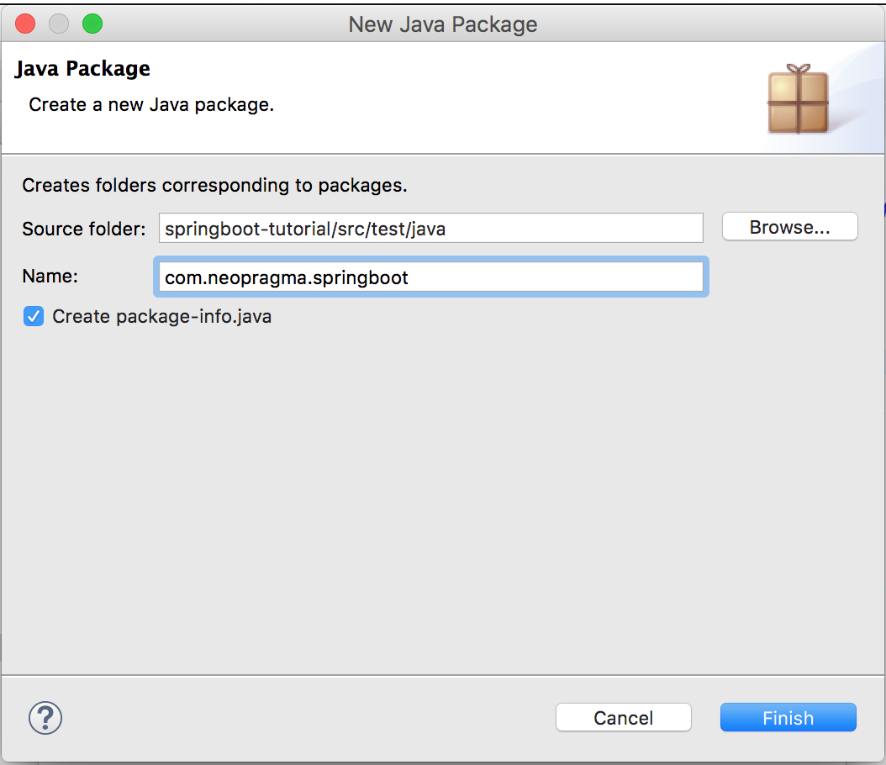

Do the same for the ```Hello.java``` file.

## 10. Commit to version control from inside the IDE

Now run the tests from inside the IDE. Right-click on ```pom.xml``` and choose Run as... Maven -> Maven test.

Looks good. Let's commit to version control from inside the IDE.

Highlight the project in Package Explorer, right-click to open the context menu, and choose Team -> Commit...

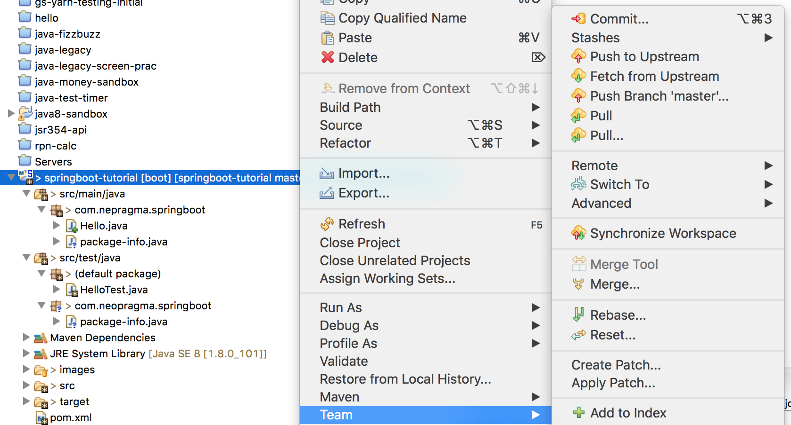

In the Git Staging tab, move the filenames into the Staged Changes section that you want to commit. 

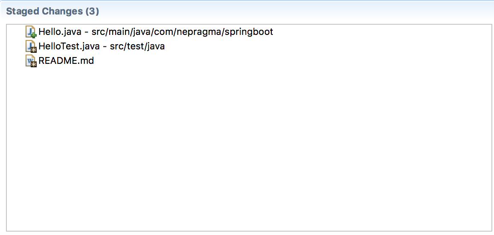

Type in an appropriate commit message.

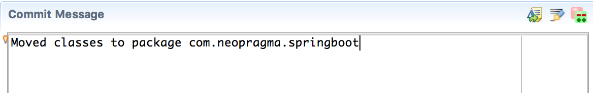

Now you can press Commit and Push in the lower right-hand area of the Git Staging tab.

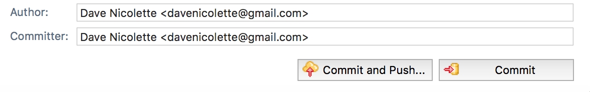

Now if you head back over to Travis CI in a browser, you'll see that the CI build was started in response to this push. So, the IDE seamlessly ties into the CI pipeline.

Some people like to commit from inside the IDE because they feel the IDE provides an all-in-one development environment. Others find it simpler to keep a command line window open and to commit from there. It's a question of personal preference.

## 11. Write a driver for a standalone Java application

The sample code from the original tutorial has a ```main``` method to run the code as a standalone Java application. We're treating that as a separate concern. Let's write a separate class now with a ```main``` method and have it drive the ```Hello``` class. 

Here there's an opportunity for a discussion about TDD. Should we test-drive the Main class? Some people would argue that every line of production code must be test-driven. Others would say this code is so trivial and so standardized that there's nothing to be gained by test-driving it. It will instantiate a ```Hello``` object and call one method with no arguments, and then exit. That's all. 

### 11.1. The Main class

Let's risk the ire of purists and just write this one.

```java  
package com.nepragma.springboot;
public class Main {	
	static Hello hello;
	public static void main(String[] args) {
		hello = new Hello();
		System.out.println(hello.greet());
		System.exit(0);
	}
}
```

Show them how to run this from inside the IDE. 

### 11.2. Create an executable jar

The way to package a standalone Java application is as an _executable jar_. Let's do that using Maven.

One of the advantages of using Springboot is that it comes with a well-implemented Maven plugin to build executable jars. It works better than the usual ```maven-assembly-plugin``` or ```maven-jar-plugin``` that you may have used in the past.

To include it, add this ```plugin``` declaration to the ```pom.xml``` file:

```shell  
<build>
    <plugins>
        <plugin>
            <groupId>org.springframework.boot</groupId>
            <artifactId>spring-boot-maven-plugin</artifactId>
        </plugin>
    </plugins>
</build>
```

You can create the executable jar from the command line like this:

```shell
mvn package
```

You can also build it from within the IDE. Spring Tool Suite comes with several Maven run configurations predefined, but they don't include one for ```mvn package```. Show participants how to create a new run configuration.

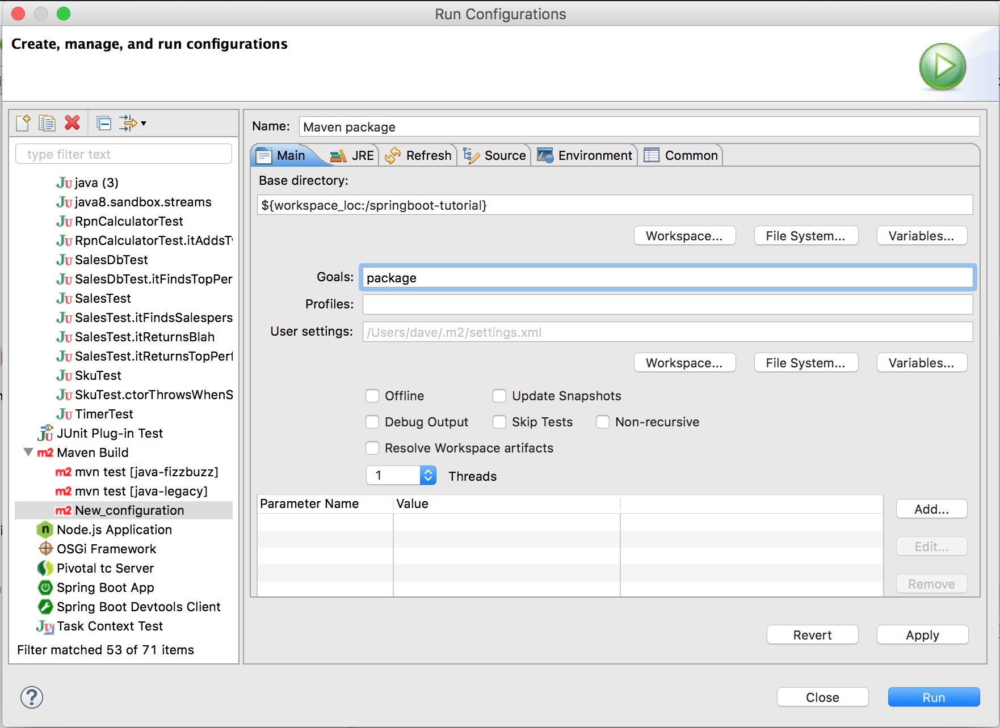

Note that by using the Springboot Maven plugin, you've made the application compatible with Cloud Foundry. Show participants the project properties in Spring Tool Suite:


This doesn't mean we _must_ deploy to Cloud Foundry. It's only a convenience built into Spring Tool Suite to support Cloud Foundry. In fact, we'll be deploying to Heroku later in this exercise (because it's free).

### 11.3. Run the application

Now you can use that run configuration to create the executable jar from within the IDE using the "Run as..." option from the context menu.

To execute the resulting application from the command line, use:

```shell
java -jar hello-0.0.1-SNAPSHOT.jar
```

To execute it from within the IDE, open the context menu and choose Run as... Java application.

### 11.4 Create a .gitignore file

When we imported the project into Spring Tool Suite, some IDE-specific files were created in the project directory that we don't want to store in version control. 

The IDE doesn't show hidden files by default. You can make it do so, but it isn't very intuitive. Show participants how to do this. 

First, locate the nearly-invisible drop-down menu button near the upper right-hand corner of the Package Explorer tab.

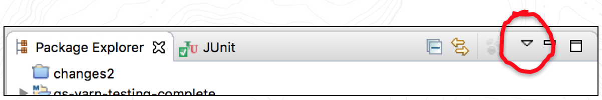

Choose Filters... to open a dialog where you can control which files appear in Package Explorer. 

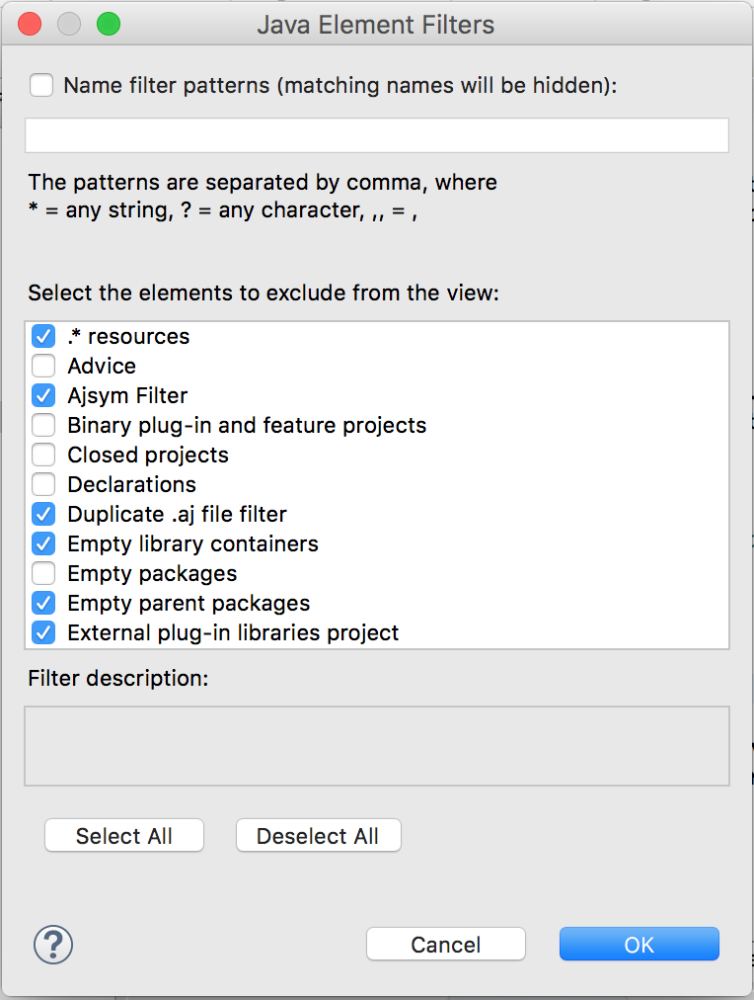

Instead of choosing which files to display, you're choosing which files _not_ to display. The entry ```.* resources``` is already checked. Uncheck it to make the IDE show hidden files in Package Explorer.

Show participants how to create a ```.gitignore``` file (or edit the one Springboot generated) to control which files will be committed to version control.

Run a ```git status``` command on the command line to see which files git is watching.

```shell
git status
```

When the author tried this on his laptop, the output from ```git status``` was:

```shell  
On branch master
Your branch is up-to-date with 'origin/master'.
Changes not staged for commit:
  (use "git add/rm <file>..." to update what will be committed)
  (use "git checkout -- <file>..." to discard changes in working directory)

	modified:   .DS_Store
	modified:   README.md
	modified:   pom.xml
	deleted:    src/main/java/Hello.java
	deleted:    target/classes/Hello.class
	modified:   target/maven-archiver/pom.properties
	modified:   target/maven-status/maven-compiler-plugin/compile/default-compile/createdFiles.lst
	modified:   target/maven-status/maven-compiler-plugin/compile/default-compile/inputFiles.lst
	modified:   target/maven-status/maven-compiler-plugin/testCompile/default-testCompile/inputFiles.lst
	deleted:    target/myproject-0.0.1-SNAPSHOT.jar
	modified:   target/surefire-reports/HelloTest.txt
	modified:   target/surefire-reports/TEST-HelloTest.xml
	modified:   target/test-classes/HelloTest.class

Untracked files:
  (use "git add <file>..." to include in what will be committed)

	.classpath
	.gitignore
	.project
	.settings/
	images/mvn-package-run-config.png
	src/main/java/com/nepragma/springboot/Main.java
	src/main/java/com/nepragma/springboot/package-info.java
	src/test/java/com/

no changes added to commit (use "git add" and/or "git commit -a")
```

The ```.DS_Store``` file is created by Mac OSX when you access files. We don't need to keep it in version control. If you're using a different operating system, you won't see that filename in the list.

We don't need anything in the ```target``` directory, as that directory is created as part of the build. We only keep sources and resource files under version control.

The files ```.classpath```, ```.project``` and the directory ```.settings``` are generated and used by Spring Tool Suite (actually, by the underlying Eclipse IDE). They are specific to the local development environment and are not part of the application source code, so we don't keep them under version control.

To prevent these files from being stored in git, we put the following entries in ```.gitignore```:

```shell  
.DS_Store
target
.classpath
.project
.settings
```

If you're using another operating system, you might see temporary files specific to that system that you'll want to include in ```.gitignore``` as well. For example, when you edit a file on Ubuntu Linux using the default text editor, it creates a temporary file with a tilde on the end of its name. Editing a file named ```MyClass.java``` will cause another file to be created, named ```MyClass.java~```. You can use wildcards in the filenames in ```.gitignore``` to prevent those files from being included:

```shell  
*~
```

You _do_ want the ```.gitignore``` file itself to be maintained under version control.

### 11.5 Commit, push, and build

Now commit and push the changes and watch the build run in Travis CI.

## 12. Setting up continuous deployment

Remind participants of the canonical delivery pipeline and/or the diagram showing loops within loops. We're going to extend the pipeline for our tutorial exercise to include automated deployment.

Go to Heroku and define the tutorial app there, using your credentials or setting up new credentials as you please. This will be a _one-off dyno_ app to execute the standalone Java application we just built.

Use the Travis and Heroku command line tools to create an encrypted API key for Heroku, like this:

```shell  
travis encrypt $(heroku auth:token) --add deploy.api_key
```

Edit the ```.travis.yml``` file and add a ```provider``` specification. The file should now look something like this:

```shell
language: java
jdk:
- oraclejdk8
deploy:
  provider: heroku
  api_key:
    secure: [a long encrypted value appears here]
```

Now when you commit and push the modified ```.travis.yml``` file to Github, the build will start on Travis CI and (assuming it worked) the application will be deployed to Heroku.

Because this is a standalone application that runs in a one-off dyno, it will not start automatically and it will not remain operational when you execute it. Show the group how to run such an app on Heroku:

```shell
heroku run bash --app springboot-tutorial
~ $ java -jar target/hello-0.0.1-SNAPSHOT.jar
Hello, World!
```

## 13. Where do we stand?

We've looked at several good development practices so far:

1. Version control [check]
1. Single branch strategy [check]
1. Separation of concerns [check]
1. Test-driven development [check]
1. Continuous Integration [check]
1. Static code analysis [not yet]
1. Automated unit tests [check]
1. Automated packaging [check]
1. Automated integration, functional, and system tests [not yet]
1. Automated deployment [check]
1. Loose ends - javadoc comments, etc. [not yet]

## 14. Some notes on application components and project structure

The original sample code for the tutorial combines the "business logic" of saying Hello with code to drive a standalone application and code to build a RESTful microservice. We separated the first two components.

In "real life" the ```hello``` jar file would be uploaded to a Nexus repository where it could be referenced as a _dependency_ in other projects. The repository could be the public Maven Central or a corporate repository behind a firewall, where virus-scanned and approved jars are maintained. 

Rather than clutter a repository with jar files from tutorial exercises, we've left the ```hello``` jar as a source-level dependency within the ```springboot-tutorial``` project. 

We'll create a separate project to build the RESTful service wrapper for the ```hello``` jar. For purposes of the tutorial, we'll just copy the ```hello``` code into that project. Bear in mind this is not the way to do things in "real life."

The tutorial continues in http://github.com/neopragma/hello-service.